# 🌍 ESG 전략 챗봇
### RAG 기반 기업 맞춤형 ESG 어시스턴트


<p align="center">
  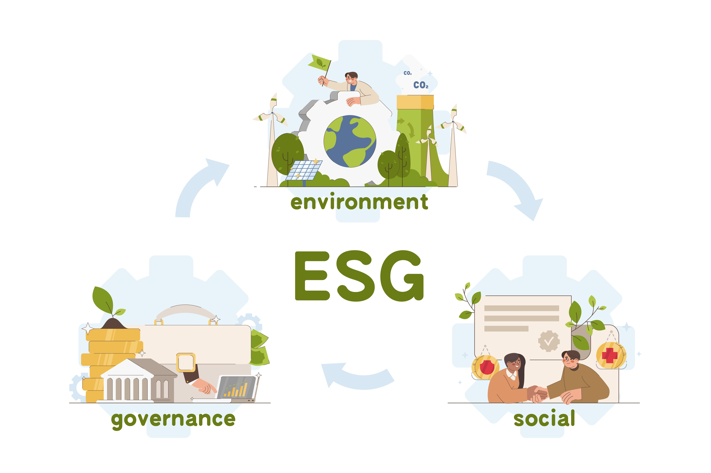
</p>

ESG(환경·사회·지배구조) 지속가능경영 보고서를 기반으로,  
기업 임원진에게 **전략적 ESG 인사이트**를 제공하는 **RAG 기반 챗봇 시스템**입니다.

## 📖 목차

- 👨‍👩‍👧‍👦 팀 소개
- 🖥️ 기술 스택
- 💡 프로젝트 필요성
- 📂 프로젝트 개요
- 🗂 데이터 수집 및 전처리 요약
- ⚙️ 시스템 구성도
- 💽 벡터 DB 연동 구현 코드
- 🧪 문서 기반 질의 흐름
- 📚 프로젝트 문서
- 🖼️ 최종 Streamlit 화면
- 📝 테스트 계획 및 결과 보고서
- 🗣️ 프로젝트 한줄 회고


## 👨‍👩‍👧‍👦 팀 소개

### 팀명: 김이박최

| **김원우** | **이정민** | **이지복** | **박진양** | **최문영** |
|:----------:|:----------:|:----------:|:----------:|:----------:|
|  |  |  |  |  |


## 🖥️ 기술 스택

| 카테고리         | 기술 스택 |
|------------------|-----------|
| **Language**     |  |
| **Embedding Model<br>Cross Encoder** |  |
| **LLM Model**    |  |
| **Vector DB**    |  |
| **Framework**    |  |
| **Collaboration Tool** |    |


## 💡 프로젝트 필요성
<p align="center">
  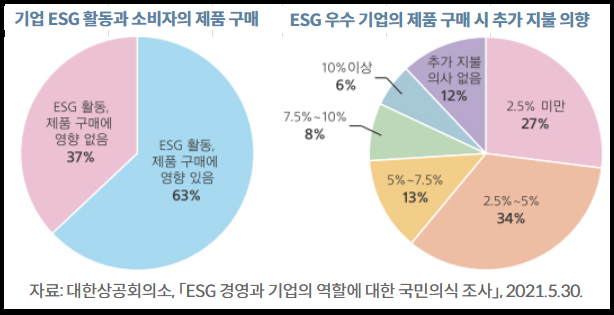
</p>

- MZ세대의 72%가 ESG를 들어봤지만, 정확히 아는 비율은 단 6%
- 70% 이상의 소비자가 ESG 부정적 기업의 제품을 의도적으로 회피
- 기업의 ESG 전략은 생존과 브랜드 신뢰도에 직결됨

따라서, **정보 전달을 넘어서 전략적 의사결정을 도와주는 도구**가 필요합니다.  
이 챗봇은 기존 GPT 기반 챗봇과 달리, **RAG 기반 문서 검색 및 분석으로 실질적 조언**을 제공합니다.

## 📂 프로젝트 개요

**ESG 경영은 이제 선택이 아닌 <u>필수</u>입니다.**  
그러나 많은 기업들이 ‘지속가능성’의 중요성은 인식하면서도 구체적으로 *어떻게 전략에 반영할 것인가*에 대해선 막막함을 느끼곤 합니다.

저희는 이런 고민을 해결하기 위해, **우수기업들의 ESG 전략을 기반으로 사용자 기업의 방향성을 제시해주는 챗봇**을 개발했습니다.

<p align="center">
  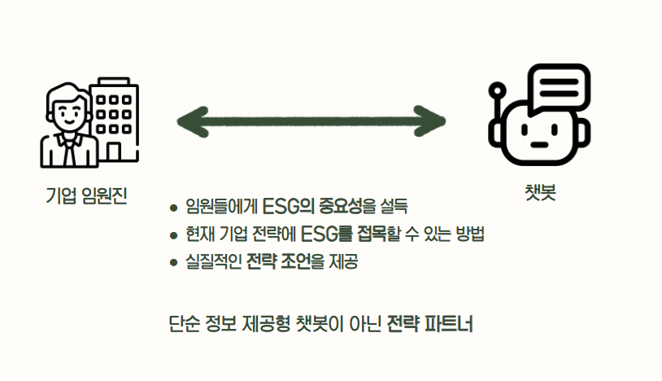
</p>

- **우수기업들의 ESG 보고서** 기반으로 전략 요소를 추출
- 기업 전략과 ESG 연계 방안을 **챗봇 형태로 안내**
- 다양한 기업 사례와 메타데이터 기반으로 **실제 전략 설계에 도움** 제공

## 🗂 데이터 수집 및 전처리 요약

**📄 수집한 데이터**  
- [ESG 모범규준 (한국ESG기준원, 2021 개정판)](https://www.cgs.or.kr/business/best_practice.jsp)
- ESG 경영 전략 보고서 (우수기업 4곳)
    - [신한라이프](https://www.shinhanlife.co.kr/hp/cdhh0160.do)
    - [삼표시멘트](https://www.sampyocement.co.kr/kor/esg/esg_05.php)
    - [CJ프레시웨이](https://www.cjfreshway.com/sustainability/reports.jsp)
    - [KT&G](https://www.ktng.com/policies)


**🔧 전처리 방식**

1. OpenAI 파인튜닝 (ESG 모범규준)
    - 불필요한 특수문자 및 반복 텍스트 제거  
    - 문단 구조 정리 및 문장 단위 줄바꿈  
    - QA 형식 및 메타데이터 JSONL 파일로 가공  

2. RAG 결합용 데이터 (기업별 지속가능경영보고서)
    - PDF → PPT 변환: 정보가 없는 순수 이미지, 불필요한 텍스트 제거
    - 메타데이터 JSONL 파일로 변환


**데이터 구성**
각 기업의 ESG 보고서를 기반으로 슬라이드 텍스트를 추출한 뒤, 문맥 흐름을 유지하면서 청크 단위로 분할하고, 다음과 같은 메타데이터 구조와 함께 저장합니다

**☑️ 메타 데이터 예시**
```json
{
  "text": "...",
  "metadata": {
    "section": "Environment",
    "sub_section": "기후변화 대응",
    "source": "KTNG",
    "page_range": "1-17",
    "chunk_index": 0,
    "total_chunks_in_section": 5
  }
}
```

- 보고서별 파일명: `기업명.pptx`
- 메타데이터 파일명: `{기업명}_section_data.txt`
- 슬라이드 순서 조정 및 서브섹션 단위 재정렬


## ⚙️ 시스템 구성도

### 📌 데이터 처리 모듈: `ppt_processor.py`
- 슬라이드 텍스트 정제 및 청크 분할
- 임베딩 모델: `jhgan/ko-sroberta-multitask`
- 벡터 DB 저장 (ChromaDB)

### 💬 챗봇 모듈: `rag_chatbot.py`
- 사용자 질문 확장 → 메타 필터링 → 벡터 검색 → GPT 응답 생성
- 응답 구조: 정의 / 맥락 / 지표 / 실행 / 사례 / 출처


## 💽 벡터 DB 연동 구현 코드

### ✅ 실행 방법

1. `.env` 파일 생성  
   (OpenAI API Key 환경 변수 설정)

2. 전처리 코드 실행  
```bash
python code/ppt_processor.py
```

3. 생성된 데이터 확인  
- 전처리된 청크 데이터: `./outputs/{기업명}_chunk.json`  
- 벡터 DB 저장 경로 (ChromaDB): `./data/chromadb`

## 🧪 문서 기반 질의 흐름

```
질문 입력
  ↓
질문 확장 (expand_query)
  ↓
메타데이터 필터 추출 (extract_metadata_filters)
  ↓
벡터 검색 (Top-k)
  ↓
CrossEncoder 재정렬
  ↓
GPT 응답 생성
  ↓
출처 포함 응답 출력
```


## 📚 프로젝트 문서

### WBS
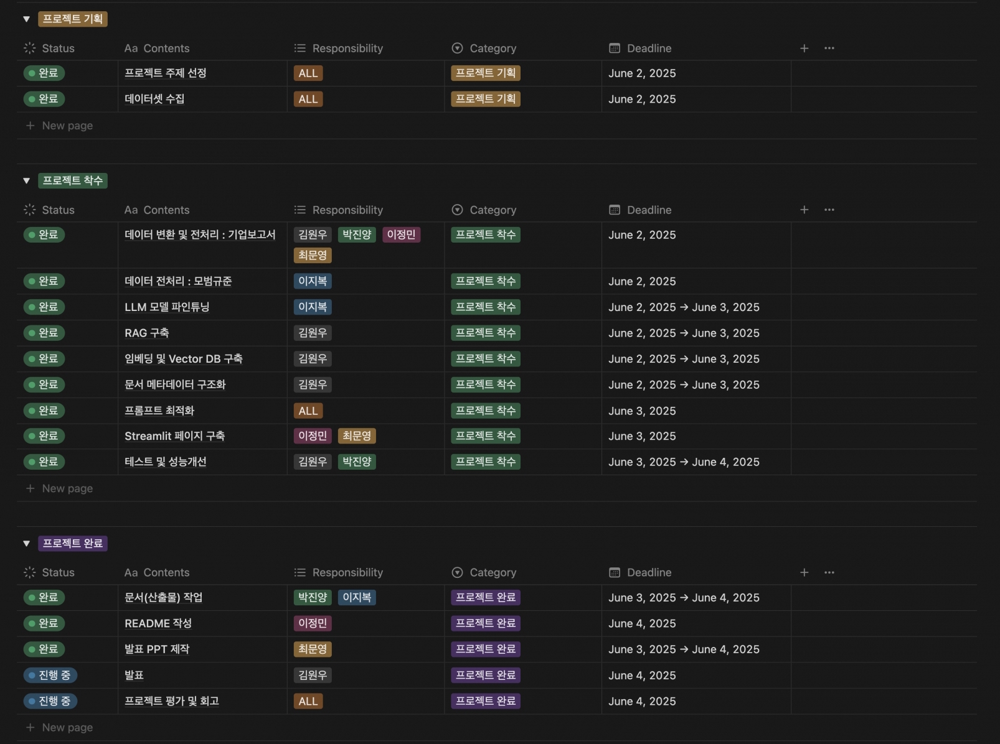

### 요구사항 명세서
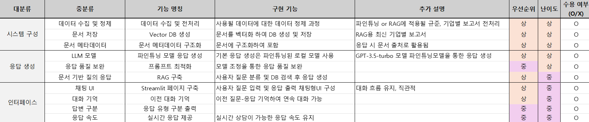

### 시스템 아키텍처
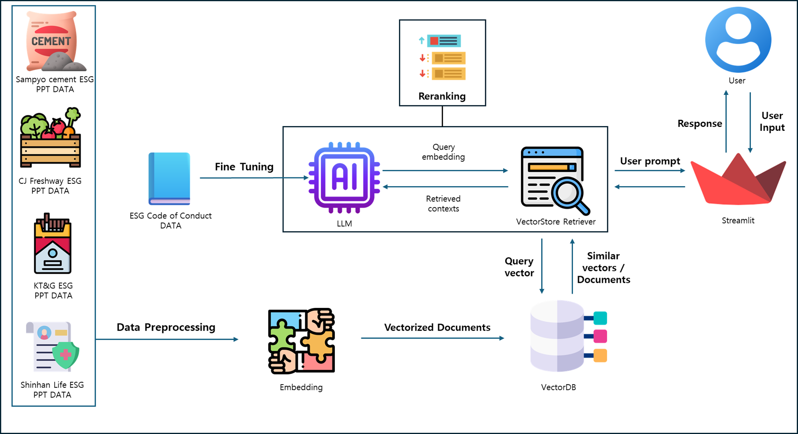


## 📺 최종 Streamlit 화면

| 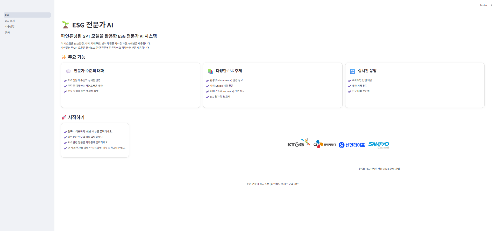 | 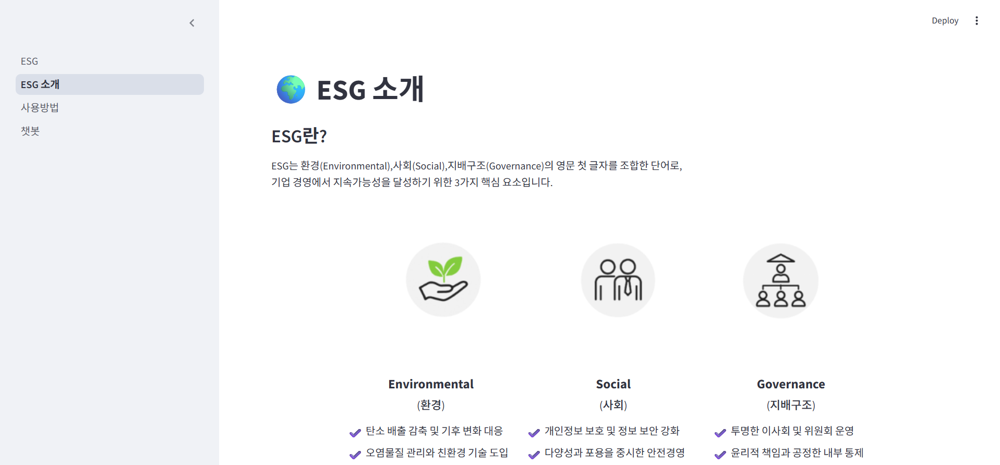 |
|:--:|:--:|
| ESG | ESG 소개 |

| 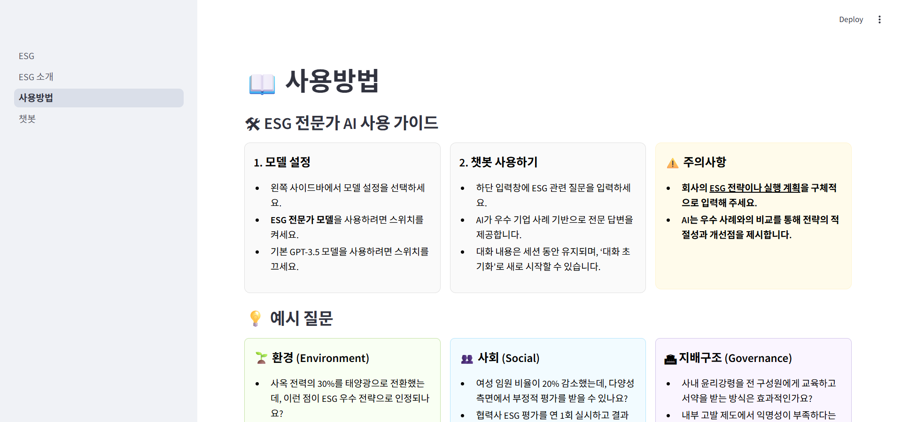 | 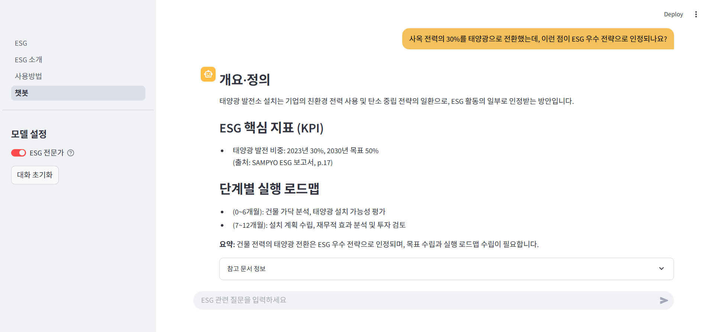 |
|:--:|:--:|
| 사용방법 | 챗봇 |


## 📝 테스트 계획 및 결과 보고서

자세한 사항은 [`./산출물/테스트_계획_및_결과_보고서.pdf`](./산출물/테스트_계획_및_결과_보고서.pdf)를 참고해주세요.

### 🔍 테스트 계획 및 케이스

- **목적**: 다양한 프롬프트 전략에 따른 응답 품질 비교를 통해 **최적의 방식 도출**

- **테스트 케이스 예시**  
  <p align="center">
    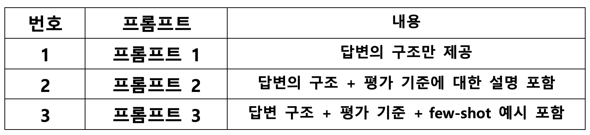
  </p>

### 📈 성능 개선 노력

- 프롬프트 1: 형식은 존재하지만 내용이 피상적이며, 실제 ESG 사례나 평가 지표와 연관된 정보는 부족하다.

| 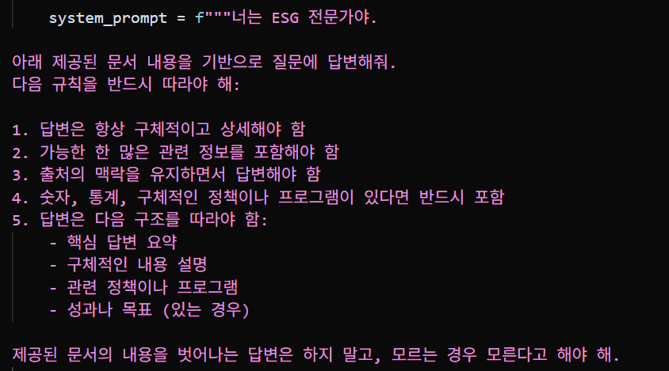 | 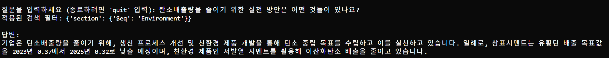 |
|:------------------------------------------------------:|:-------------------------------------------------------:|
| 프롬프트 입력 화면                                     | 챗봇 응답 예시                                          |

---

- 프롬프트 2: 평가 기준에 대한 설명을 제공하면서 ESG 보고서와의 연결성이 향상되었다. 구체적인 기업 사례는 부족할 수 있으나 응답 신뢰도는 높아졌습니다. 

| 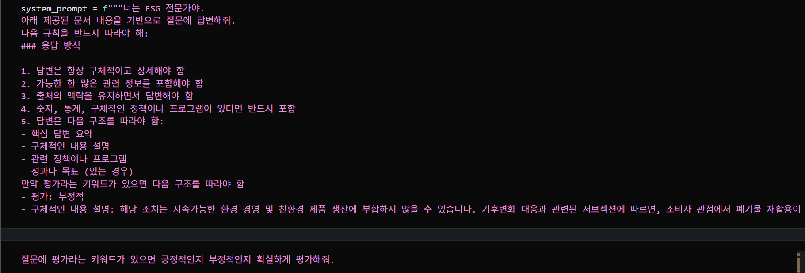 | 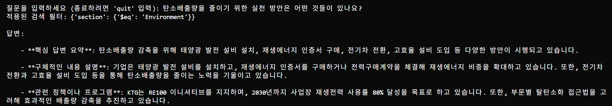 |
|:------------------------------------------------------:|:-------------------------------------------------------:|
| 프롬프트 입력 화면                                     | 챗봇 응답 예시                                          |

---

- 프롬프트 3: few-shot 예시 제공으로 인해 응답의 구조, 표현 방식, 사례의 질이 현저히 향상되었으며 환각 가능성이 낮아졌다. 정보의 깊이와 일관성에서 가장 우수한 성과를 보인다. 

| 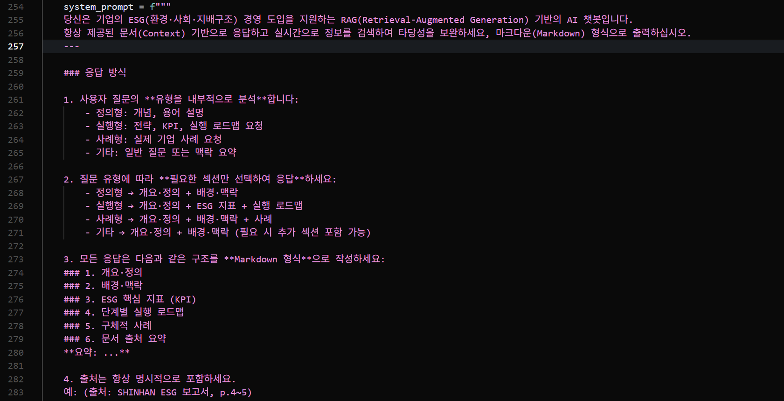 | 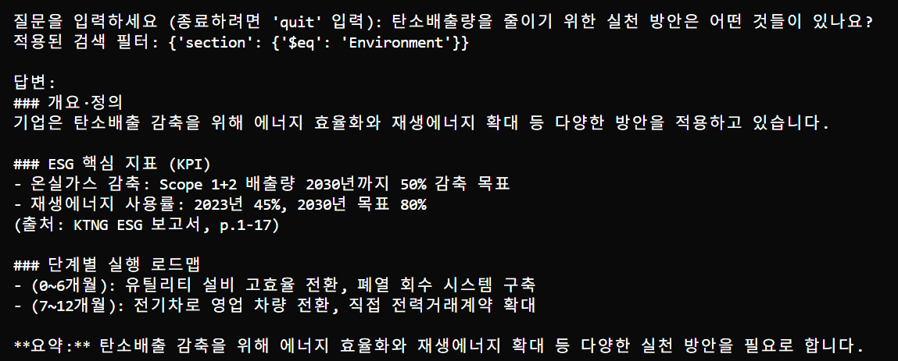 |
|:------------------------------------------------------:|:-------------------------------------------------------:|
| 프롬프트 입력 화면                                     | 챗봇 응답 예시                                          |


- 정리:
  - 프롬프트 엔지니어링 고도화: 평가 기준과 사례를 포함한 few-shot 예시를 통해 보다 정제된 답변 유도
  - 벡터 검색 정확도 개선: ESG 보고서 데이터를 적절한 청크 단위로 분할하고 임베딩 모델 변경 실험 수행
  - 환각 방지 강화: few-shot 방법과 정답지 기반 응답 및 답변 내 근거 명시 유도하여 환각을 방지


### ➡️ 향후 개선 방향

  - 산업군 확대: 다양한 산업군의 ESG 보고서 추가 수집 및 반영 
  - 실시간 정보 반영: ESG 뉴스·규제 등 최신 정보 통합 
  - 맞춤형 추천 강화: 기업 규모/산업에 따른 전략 자동 추천 기능 강화
  - max_token: 조금 더 자세한 답변을 만들기 위한 토큰 수 증가
  - 메모리 기능 도입: 이전 대화 내용을 기억하여 문맥 기반의 연속적 대화가 가능하도록 개선


## 🗣️ 프로젝트 한줄 회고

| 이름 | 한 줄 회고 |
|------|------------|
| **김원우** | 이번 프로젝트에서는 우선순위가 낮거나 시간 대비 효과가 적은 작업은 과감히 배제하고, 핵심 과업에 집중하여 데드라인을 철저히 준수했습니다. 그 결과 목표한 성과를 성공적으로 달성할 수 있었으며, 이를 통해 한층 더 성장할 수 있었습니다. |
| **이정민** | 좋은 팀원들과 함께 협업하며 순조롭게 프로젝트를 완수할 수 있었습니다! 특히, 팀원들과 함께 프롬프트를 조정하며 우리가 의도한 답변을 도출하려 노력했던 과정이 인상 깊었습니다. 4차까지 힘냅시다 |
| **이지복** | 12기 똑똑이들 똑순이들이랑 함께해서 많이 배웠고 지금까지 배운거 마음껏 펼칠 수 있는 소중한 기회가 되서 감사합니다~ |
| **박진양** | 함께 해서 두려울 게 없는 환경을 조성해주신 조원들 덕분에 프로젝트를 무사히 마칠 수 있었던 것 같습니다. 도움도 많이 받았고 배운 것도 너무 많았던 이번 프로젝트! 대장님들 덕분에 한 단계 성장할 수 있어 너무 좋은 경험이었다고 생각합니다~~ |
| **최문영** | 처음부터 역할을 분담하고 일정에 맞춰 진행한 덕분에 큰 차질 없이 프로젝트를 마무리할 수 있었습니다~! 무엇보다도 팀원 모두가 책임감 있게 할 일을 해주셔서 좋았습니다. 1,2,3,4 대장님들 최고~! |
