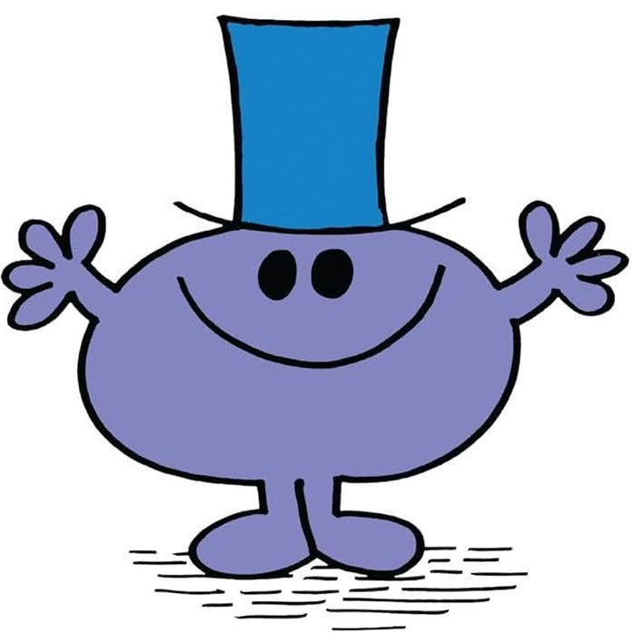

# 🌍 ESG 전략 챗봇
### RAG 기반 기업 맞춤형 ESG 어시스턴트

<p align="center">
  
</p>

ESG(환경·사회·지배구조) 지속가능경영 보고서를 기반으로,  
기업 임원진에게 **전략적 ESG 인사이트**를 제공하는 **RAG 기반 챗봇 시스템**입니다.


## 👨‍👩‍👧‍👦 팀 소개

| 김원우 | 박진양 | 이정민 | 이지복 | 최문영 |
|:------:|:------:|:------:|:------:|:------:|
|  |  |  |  |  |


## ⚙ 기술 스택

| 카테고리         | 기술 스택 |
|------------------|-----------|
| **Language**     |  |
| **Embedding Model** |  |
| **LLM Model**    |  |
| **Vector DB**    |  |
| **Framework**    |  |
| **Collaboration Tool** |    |


## 💡 프로젝트 필요성
<p align="center">
  
</p>

- MZ세대의 72%가 ESG를 들어봤지만, 정확히 아는 비율은 단 6%
- 70% 이상의 소비자가 ESG 부정적 기업의 제품을 의도적으로 회피
- 기업의 ESG 전략은 생존과 브랜드 신뢰도에 직결됨

따라서, **정보 전달을 넘어서 전략적 의사결정을 도와주는 도구**가 필요합니다.  
이 챗봇은 기존 GPT 기반 챗봇과 달리, **RAG 기반 문서 검색 및 분석으로 실질적 조언**을 제공합니다.

## 📌 프로젝트 개요

**ESG 경영은 이제 선택이 아닌 <u>필수</u>입니다.**  
그러나 많은 기업들이 ‘지속가능성’의 중요성은 인식하면서도 구체적으로 *어떻게 전략에 반영할 것인가*에 대해선 막막함을 느끼곤 합니다.

저희는 이런 고민을 해결하기 위해, **우수기업들의 ESG 전략을 기반으로 사용자 기업의 방향성을 제시해주는 챗봇**을 개발했습니다.

<p align="center">
  
</p>

- **우수기업들의 ESG 보고서** 기반으로 전략 요소를 추출
- 기업 전략과 ESG 연계 방안을 **챗봇 형태로 안내**
- 다양한 기업 사례와 메타데이터 기반으로 **실제 전략 설계에 도움** 제공

## 🗂 데이터 수집 및 전처리 요약

**📄 수집한 데이터**  
- [ESG 모범규준 (한국ESG기준원, 2021 개정판)](https://www.cgs.or.kr/business/best_practice.jsp)
- ESG 경영 전략 보고서 (우수기업 4곳)
    - [신한라이프](https://www.shinhanlife.co.kr/hp/cdhh0160.do)
    - [삼표시멘트](https://www.sampyocement.co.kr/kor/esg/esg_05.php)
    - [CJ프레시웨이](https://www.cjfreshway.com/sustainability/reports.jsp)
    - [KT&G](https://www.ktng.com/policies)


**🔧 전처리 방식**

1. OpenAI 파인튜닝 (ESG 모범규준)
    - 불필요한 특수문자 및 반복 텍스트 제거  
    - 문단 구조 정리 및 문장 단위 줄바꿈  
    - QA 형식 및 메타데이터 JSONL 파일로 가공  

2. RAG 결합용 데이터 (기업별 지속가능경영보고서)
    - PDF → PPT 변환: 정보가 없는 순수 이미지, 불필요한 텍스트 제거
    - 메타데이터 JSONL 파일로 변환


**데이터 구성**
각 기업의 ESG 보고서를 기반으로 슬라이드 텍스트를 추출한 뒤, 문맥 흐름을 유지하면서 청크 단위로 분할하고, 다음과 같은 메타데이터 구조와 함께 저장합니다

**☑️ 메타 데이터 예시**
```json
{
  "text": "...",
  "metadata": {
    "section": "Environment",
    "sub_section": "기후변화 대응",
    "source": "KTNG",
    "page_range": "1-17",
    "chunk_index": 0,
    "total_chunks_in_section": 5
  }
}
```

- 보고서별 파일명: `기업명.pptx`
- 메타데이터 파일명: `{기업명}_section_data.txt`
- 슬라이드 순서 조정 및 서브섹션 단위 재정렬


## ⚙ 시스템 구성도

### 📌 데이터 처리 모듈: `ppt_processor.py`
- 슬라이드 텍스트 정제 및 청크 분할
- 임베딩 모델: `jhgan/ko-sroberta-multitask`
- 벡터 DB 저장 (ChromaDB)

### 💬 챗봇 모듈: `rag_chatbot.py`
- 사용자 질문 확장 → 메타 필터링 → 벡터 검색 → GPT 응답 생성
- 응답 구조: 정의 / 맥락 / 지표 / 실행 / 사례 / 출처


## 💽 벡터 DB 연동 구현 코드

추가 예정

## 🧪 문서 기반 질의 흐름

```
질문 입력
  ↓
질문 확장 (expand_query)
  ↓
메타데이터 필터 추출 (extract_metadata_filters)
  ↓
벡터 검색 (Top-k)
  ↓
CrossEncoder 재정렬
  ↓
GPT 응답 생성
  ↓
출처 포함 응답 출력
```


## 📌 프로젝트 문서

### WBS


### 요구사항 명세서


### 시스템 아키텍처


## 🔌 테스트 계획 및 결과 보고서

추가 예정


## ✂️ 성능 개선 노력

추가예정


## 🔮 향후 개선 방향

추가 예정


## 프로젝트 한줄 회고

|   이름   |    한 줄 회고    | 
|---------|------------|
|**김원우**| 회고 작성 예정 |
|**박진양**| 회고 작성 예정 |
|**이정민**| 회고 작성 예정 |
|**이지복**| 회고 작성 예정 |
|**최문영**| 회고 작성 예정 |

